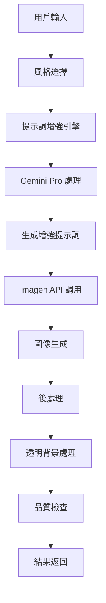

# AI Icon & Illustration Generator 技術文檔

## 📋 專案概述

AI Icon & Illustration Generator 是一個專業的圖標與插畫生成工具，旨在為設計師、產品經理和創意工作者提供高品質、風格化的透明 PNG 圖像。系統的核心理念是「隱藏提示詞工程的複雜性，提供直觀的創意工作流程」。

## 🎯 核心功能

### 主要特性
1. **引導式用戶輸入**: 結構化的創意輸入界面，而非簡單的文字框
2. **AI 提示詞增強引擎**: 將簡單輸入轉化為詳細的專業提示詞
3. **高品質圖像生成**: 使用 Imagen 4.0 生成透明背景的專業圖像
4. **多樣化風格系統**: 預定義的專業風格選項
5. **即時預覽與下載**: 清晰的結果展示和便捷的下載功能

### 設計哲學
- **工作流程導向**: UI 本身就是提示詞建構器
- **實用性優先**: 生成的圖像必須立即可用
- **風格為先**: 通過高品質的預定義風格定義產品特色

## 🏗️ 系統架構

### 技術棧
```
前端: Next.js + TypeScript + Tailwind CSS + Shadcn/ui
後端: Python FastAPI
AI 服務: Google Gemini API (文字模型 + Imagen 圖像模型)
存儲: 本地文件系統
```

### 核心組件

#### 1. 提示詞增強引擎
```python
class PromptEnhancementEngine:
    def enhance_prompt(
        self, 
        subject: str, 
        style: str, 
        composition: str
    ) -> str
```
- **功能**: 將用戶的簡單輸入轉化為專業的圖像生成提示詞
- **輸入**: 核心主題、風格選擇、構圖偏好
- **輸出**: 詳細的、技術性的英文提示詞
- **特色**: 使用 Gemini Pro 進行智能擴展和優化

#### 2. 圖像生成服務
```python
async def generate_image_with_imagen(
    enhanced_prompt: str,
    aspect_ratio: str = "1:1",
    quality: str = "high"
) -> ImageResult
```
- **功能**: 使用 Imagen 4.0 Fast Generate 生成高品質圖像
- **特色**: 自動透明背景處理、高解析度輸出
- **格式**: PNG 格式，支援透明背景

#### 3. 風格管理系統
```python
class StyleManager:
    PREDEFINED_STYLES = {
        "minimalist": {...},
        "corporate": {...},
        "creative": {...},
        "vintage": {...}
    }
```
- **功能**: 管理預定義的視覺風格
- **包含**: 色彩方案、構圖規則、藝術風格、技術參數
- **擴展性**: 易於添加新風格和自定義選項

## 📊 數據模型

### 核心數據結構

#### GenerationRequest (生成請求)
```python
class GenerationRequest(BaseModel):
    subject: str           # 核心主題
    style: str            # 風格選擇
    composition: str      # 構圖類型
    color_preference: str # 色彩偏好
    use_case: str        # 使用場景
```

#### ImageResult (圖像結果)
```python
class ImageResult(BaseModel):
    image_url: str        # 生成的圖像 URL
    enhanced_prompt: str  # 增強後的提示詞
    generation_time: float # 生成時間
    style_applied: str    # 應用的風格
    metadata: Dict[str, Any] # 額外元數據
```

#### StyleDefinition (風格定義)
```python
class StyleDefinition(BaseModel):
    name: str
    description: str
    color_palette: List[str]
    composition_rules: List[str]
    art_style: str
    technical_params: Dict[str, Any]
```

## 🎨 風格系統設計

### 預定義風格

#### 1. 極簡主義 (Minimalist)
```json
{
  "color_palette": ["monochromatic", "high contrast"],
  "composition": ["clean lines", "negative space", "geometric"],
  "art_style": "vector illustration",
  "mood": ["clean", "professional", "modern"]
}
```

#### 2. 企業正式 (Corporate)
```json
{
  "color_palette": ["navy blue", "gray", "white"],
  "composition": ["balanced", "structured", "professional"],
  "art_style": "clean vector design",
  "mood": ["trustworthy", "reliable", "professional"]
}
```

#### 3. 創意活潑 (Creative)
```json
{
  "color_palette": ["vibrant", "playful", "gradient"],
  "composition": ["dynamic", "asymmetrical", "energetic"],
  "art_style": ["illustration", "artistic"],
  "mood": ["creative", "inspiring", "innovative"]
}
```

#### 4. 復古懷舊 (Vintage)
```json
{
  "color_palette": ["muted", "sepia", "earth tones"],
  "composition": ["classic", "ornate", "decorative"],
  "art_style": ["retro illustration", "vintage poster"],
  "mood": ["nostalgic", "classic", "timeless"]
}
```

## 🔄 生成流程

### 圖像生成工作流程


### 提示詞增強策略

#### 多層次提示詞結構
1. **主題描述**: 將抽象概念轉化為具體視覺元素
2. **風格應用**: 根據選擇的風格添加相應的視覺關鍵詞
3. **技術規範**: 添加品質、格式、解析度等技術要求
4. **負面提示詞**: 排除不需要的元素（文字、水印等）

#### 範例轉換
```
用戶輸入: "創新科技"
風格: "現代科技"

增強後提示詞:
"A sleek, futuristic technology icon featuring abstract geometric shapes with glowing blue accents, minimalist design, clean vector illustration style, high contrast, professional lighting, transparent background, no text, 4K resolution"
```

## 🚀 API 端點

### 主要 API 路由

#### 1. 生成圖標
```http
POST /api/generate-icon
Content-Type: application/json

{
  "subject": "創新科技",
  "style": "modern_tech",
  "composition": "centered",
  "color_preference": "blue_accent",
  "use_case": "presentation"
}
```

#### 2. 獲取風格列表
```http
GET /api/styles
```

#### 3. 預覽風格效果
```http
POST /api/preview-style
Content-Type: application/json

{
  "style": "minimalist",
  "subject": "sample"
}
```

#### 4. 下載圖像
```http
GET /api/download/{image_id}
```

#### 5. 獲取生成歷史
```http
GET /api/history
```

## 🔧 配置與部署

### 環境變數
```env
# Google AI 服務配置
GEMINI_API_KEY=your_gemini_api_key_here

# 圖像存儲配置
GENERATED_IMAGES_DIR=./generated_images
MAX_IMAGE_SIZE=10MB
SUPPORTED_FORMATS=png

# 生成參數
DEFAULT_RESOLUTION=1024x1024
MAX_GENERATION_TIME=30
ENABLE_TRANSPARENT_BACKGROUND=true

# 風格配置
CUSTOM_STYLES_ENABLED=false
MAX_CUSTOM_STYLES=10
```

### 部署需求
- **Python**: 3.8+
- **Node.js**: 18+
- **磁盤空間**: 至少 20GB (用於圖像存儲)
- **記憶體**: 建議 8GB+ (圖像處理)
- **GPU**: 可選，用於本地圖像處理加速

### 性能優化
1. **圖像緩存**: 對常見請求進行結果緩存
2. **異步處理**: 使用隊列系統處理生成請求
3. **CDN 整合**: 使用 CDN 加速圖像傳輸
4. **批量處理**: 支援批量圖標生成

## 📈 品質控制

### 圖像品質標準
- **解析度**: 最低 1024x1024 像素
- **格式**: PNG 格式，支援透明背景
- **色彩**: 24位真彩色或 32位 RGBA
- **檔案大小**: 控制在 2MB 以內

### 內容過濾
- **不當內容檢測**: 自動過濾不適當的生成結果
- **版權保護**: 避免生成受版權保護的內容
- **品牌安全**: 確保生成內容符合商業使用標準

### 使用者反饋系統
```python
class FeedbackSystem:
    def collect_rating(self, image_id: str, rating: int, comment: str)
    def analyze_feedback(self) -> QualityReport
    def improve_generation_quality(self, feedback_data: List[Feedback])
```

## 🧪 測試策略

### 功能測試
- 提示詞增強準確性測試
- 圖像生成品質測試
- 風格一致性驗證
- API 響應時間測試

### 視覺測試
- 不同風格的視覺效果驗證
- 透明背景處理測試
- 色彩準確性檢查
- 解析度和清晰度測試

### 負載測試
- 並發生成請求處理
- 大量圖像存儲管理
- API 限流和錯誤處理

## 🔮 未來發展

### 短期目標
1. **自定義風格**: 允許用戶創建和保存個人風格
2. **批量生成**: 支援一次生成多個相關圖標
3. **向量格式**: 支援 SVG 格式輸出

### 長期規劃
1. **AI 風格學習**: 基於用戶偏好自動調整風格
2. **品牌一致性**: 企業級品牌風格定制
3. **動態圖標**: 支援簡單的動畫效果

### 商業化功能
1. **高級風格包**: 付費的專業風格選項
2. **API 訂閱**: 面向開發者的 API 服務
3. **企業版**: 私有部署和定制化服務

---

**維護者**: AI Tools 開發團隊  
**最後更新**: 2024年12月  
**版本**: v1.0.0