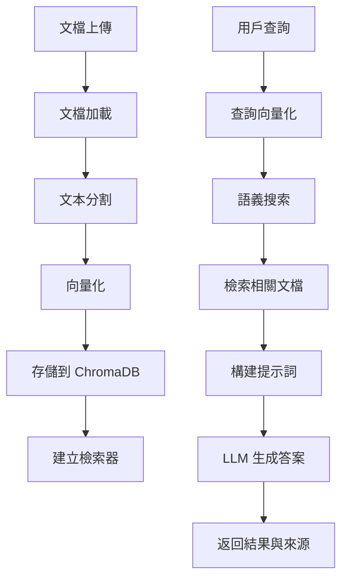

# Interactive Document Knowledge Base (RAG) 技術文檔

## 📋 專案概述

Interactive Document Knowledge Base 是一個基於檢索增強生成 (RAG) 技術的智能文檔問答系統。該系統允許用戶上傳多種格式的文檔，建立持久化的知識庫，並通過自然語言查詢獲得準確、有來源引用的答案。

## 🎯 核心功能

### 主要特性
1. **多文檔問答**: 基於上傳文檔內容的智能問答系統
2. **文檔摘要生成**: 自動生成單個文檔或整個知識庫的摘要
3. **智能測驗生成**: 基於文檔內容自動創建多選題測驗
4. **來源引用**: 所有答案都包含具體的文檔來源引用
5. **持久化存儲**: 「上傳一次，多次查詢」的高效架構

### 技術亮點
- **完整 RAG 管道**: 從文檔攝取到答案生成的端到端流程
- **LangChain 框架**: 使用 LangChain 的標準化組件和鏈式操作
- **向量數據庫**: ChromaDB 提供高效的語義搜索
- **多格式支援**: PDF、Word、文本等多種文檔格式
- **增量更新**: 支援動態添加新文檔到現有知識庫

## 🏗️ 系統架構

### 技術棧
```
前端: Next.js + TypeScript + Tailwind CSS
後端: Python FastAPI + LangChain
向量數據庫: ChromaDB (本地持久化)
嵌入模型: Google text-embedding-004
語言模型: Google Gemini 2.0 Flash Exp
文檔處理: PyPDFLoader, UnstructuredFileLoader
```

### RAG 架構組件

#### 1. 文檔攝取管道 (Document Ingestion Pipeline)
```python
class DocumentProcessor:
    def process_documents(self, file_paths: List[str]) -> List[Document]:
        # 1. 文檔加載
        # 2. 文本分割
        # 3. 向量化
        # 4. 存儲到向量庫
```

**處理流程**:
```
文件上傳 → 文檔加載 → 文本分割 → 向量化 → 存儲到 ChromaDB
```

#### 2. 檢索系統 (Retrieval System)
```python
class RetrievalSystem:
    def retrieve_relevant_docs(
        self, 
        query: str, 
        k: int = 5
    ) -> List[Document]:
        # 語義搜索和相關文檔檢索
```

#### 3. 生成系統 (Generation System)
```python
class QAChain:
    def generate_answer(
        self, 
        query: str, 
        context_docs: List[Document]
    ) -> AnswerWithSources:
        # 基於檢索到的文檔生成答案
```

## 📊 核心模組詳解

### 1. RAG 服務 (`rag_service.py`)

#### 主要類別和方法
```python
class RAGService:
    def __init__(self):
        self.embeddings = GoogleGenerativeAIEmbeddings(
            model="models/text-embedding-004"
        )
        self.llm = ChatGoogleGenerativeAI(
            model="gemini-2.0-flash-exp",
            temperature=0.3
        )
        self.vector_store = Chroma(
            persist_directory="./vector_store",
            embedding_function=self.embeddings
        )
    
    async def process_documents(self, file_paths: List[str]) -> ProcessingResult
    async def query_documents(self, question: str) -> QAResult
    async def generate_summary(self, doc_ids: List[str]) -> SummaryResult
    async def generate_quiz(self, doc_ids: List[str]) -> QuizResult
```

#### 文檔處理流程
```python
def process_documents(self, file_paths: List[str]):
    # 1. 文檔加載
    documents = []
    for file_path in file_paths:
        if file_path.endswith('.pdf'):
            loader = PyPDFLoader(file_path)
        else:
            loader = UnstructuredFileLoader(file_path)
        documents.extend(loader.load())
    
    # 2. 文本分割
    text_splitter = RecursiveCharacterTextSplitter(
        chunk_size=1000,
        chunk_overlap=200
    )
    splits = text_splitter.split_documents(documents)
    
    # 3. 向量化並存儲
    self.vector_store.add_documents(splits)
```

#### 問答鏈構建
```python
def create_qa_chain(self):
    # 創建檢索器
    retriever = self.vector_store.as_retriever(
        search_kwargs={"k": 5}
    )
    
    # 定義提示詞模板
    prompt_template = """
    基於以下文檔內容回答問題，並提供具體的來源引用：
    
    文檔內容：
    {context}
    
    問題：{question}
    
    請提供詳細的答案，並在答案末尾列出所有相關的來源文檔。
    """
    
    # 創建 QA 鏈
    qa_chain = RetrievalQA.from_chain_type(
        llm=self.llm,
        chain_type="stuff",
        retriever=retriever,
        return_source_documents=True
    )
    
    return qa_chain
```

### 2. 文檔處理器 (`document_processor.py`)

#### 支援的文檔格式
```python
SUPPORTED_FORMATS = {
    '.pdf': PyPDFLoader,
    '.docx': UnstructuredWordDocumentLoader,
    '.txt': TextLoader,
    '.md': UnstructuredMarkdownLoader,
    '.html': UnstructuredHTMLLoader
}
```

#### 智能文本分割
```python
class SmartTextSplitter:
    def __init__(self):
        self.splitter = RecursiveCharacterTextSplitter(
            chunk_size=1000,
            chunk_overlap=200,
            length_function=len,
            separators=["\n\n", "\n", " ", ""]
        )
    
    def split_documents(self, documents: List[Document]) -> List[Document]:
        # 根據文檔類型調整分割策略
        return self.splitter.split_documents(documents)
```

### 3. 向量存儲管理 (`vector_store_manager.py`)

#### ChromaDB 配置
```python
class VectorStoreManager:
    def __init__(self, persist_directory: str = "./vector_store"):
        self.embeddings = GoogleGenerativeAIEmbeddings(
            model="models/text-embedding-004"
        )
        self.vector_store = Chroma(
            persist_directory=persist_directory,
            embedding_function=self.embeddings,
            collection_metadata={"hnsw:space": "cosine"}
        )
    
    def add_documents(self, documents: List[Document]) -> List[str]:
        # 添加文檔到向量庫
        return self.vector_store.add_documents(documents)
    
    def similarity_search(self, query: str, k: int = 5) -> List[Document]:
        # 執行語義搜索
        return self.vector_store.similarity_search(query, k=k)
```

## 📊 數據模型

### 核心數據結構

#### Document (文檔)
```python
class Document(BaseModel):
    page_content: str           # 文檔內容
    metadata: Dict[str, Any]    # 元數據（來源、頁碼等）
```

#### QAResult (問答結果)
```python
class QAResult(BaseModel):
    question: str               # 用戶問題
    answer: str                # 生成的答案
    source_documents: List[Document]  # 來源文檔
    confidence_score: float     # 信心分數
    processing_time: float      # 處理時間
```

#### ProcessingResult (處理結果)
```python
class ProcessingResult(BaseModel):
    session_id: str            # 會話 ID
    processed_files: List[str] # 已處理的文件
    total_chunks: int          # 總文本塊數
    processing_time: float     # 處理時間
    status: str               # 處理狀態
```

#### QuizQuestion (測驗問題)
```python
class QuizQuestion(BaseModel):
    question: str              # 問題內容
    options: List[str]         # 選項列表
    correct_answer: int        # 正確答案索引
    explanation: str           # 答案解釋
    source_document: str       # 來源文檔
```

## 🔄 RAG 工作流程

### 完整的 RAG 管道


### 查詢處理流程
```python
async def process_query(self, question: str, session_id: str) -> QAResult:
    # 1. 檢索相關文檔
    relevant_docs = self.vector_store.similarity_search(
        question, 
        k=5,
        filter={"session_id": session_id}
    )
    
    # 2. 構建上下文
    context = "\n\n".join([doc.page_content for doc in relevant_docs])
    
    # 3. 生成答案
    prompt = self.create_qa_prompt(question, context)
    response = await self.llm.agenerate([prompt])
    
    # 4. 返回結果
    return QAResult(
        question=question,
        answer=response.generations[0][0].text,
        source_documents=relevant_docs,
        confidence_score=self.calculate_confidence(relevant_docs),
        processing_time=time.time() - start_time
    )
```

## 🚀 API 端點

### 主要 API 路由

#### 1. 上傳文檔
```http
POST /api/upload-documents
Content-Type: multipart/form-data

{
  "files": [<file1>, <file2>, ...],
  "session_name": "我的知識庫"
}
```

#### 2. 查詢文檔
```http
POST /api/query
Content-Type: application/json

{
  "question": "什麼是機器學習？",
  "session_id": "uuid",
  "max_results": 5
}
```

#### 3. 生成摘要
```http
POST /api/generate-summary
Content-Type: application/json

{
  "session_id": "uuid",
  "doc_ids": ["doc1", "doc2"],
  "summary_type": "comprehensive"
}
```

#### 4. 生成測驗
```http
POST /api/generate-quiz
Content-Type: application/json

{
  "session_id": "uuid",
  "num_questions": 10,
  "difficulty": "medium"
}
```

#### 5. 獲取會話列表
```http
GET /api/sessions
```

#### 6. 刪除會話
```http
DELETE /api/session/{session_id}
```

## 🔧 配置與部署

### 環境變數
```env
# Google AI 服務配置
GEMINI_API_KEY=your_gemini_api_key_here

# 向量數據庫配置
VECTOR_STORE_PATH=./vector_store
CHROMA_PERSIST_DIRECTORY=./vector_store

# 文檔處理配置
MAX_FILE_SIZE=50MB
SUPPORTED_FORMATS=pdf,docx,txt,md,html
CHUNK_SIZE=1000
CHUNK_OVERLAP=200

# 檢索配置
DEFAULT_K=5
MAX_K=20
SIMILARITY_THRESHOLD=0.7

# LLM 配置
LLM_TEMPERATURE=0.3
MAX_TOKENS=2048
```

### 部署需求
- **Python**: 3.8+
- **Node.js**: 18+
- **磁盤空間**: 至少 50GB (用於向量數據庫和文檔存儲)
- **記憶體**: 建議 16GB+ (向量計算和大型文檔處理)
- **CPU**: 多核心處理器 (並行文檔處理)

### 性能優化
1. **批量處理**: 並行處理多個文檔
2. **增量索引**: 支援動態添加文檔而不重建整個索引
3. **緩存機制**: 對常見查詢結果進行緩存
4. **分片存儲**: 大型知識庫的分片管理

## 📈 監控與分析

### 系統監控指標
- **檢索質量**: 相關文檔的準確率和召回率
- **響應時間**: 查詢處理的平均時間
- **存儲使用**: 向量數據庫的存儲空間使用情況
- **API 使用量**: Gemini API 的調用次數和成本

### 品質評估
```python
class QualityMetrics:
    def calculate_retrieval_accuracy(self, queries: List[str]) -> float:
        # 計算檢索準確率
        pass
    
    def measure_answer_relevance(self, qa_pairs: List[Tuple]) -> float:
        # 評估答案相關性
        pass
    
    def analyze_user_satisfaction(self, feedback: List[Feedback]) -> Report:
        # 分析用戶滿意度
        pass
```

## 🧪 測試策略

### 功能測試
- 文檔上傳和處理測試
- 向量化和檢索準確性測試
- 問答生成品質測試
- 來源引用準確性驗證

### 性能測試
- 大型文檔集合的處理性能
- 並發查詢的響應時間
- 向量數據庫的查詢效率
- 記憶體使用量監控

### 整合測試
- 端到端的 RAG 流程測試
- 多會話並行處理測試
- API 端點的完整性測試

## 🔮 未來發展

### 短期目標
1. **多模態支援**: 支援圖像和表格內容的理解
2. **高級檢索**: 實現混合檢索（關鍵詞 + 語義）
3. **個性化**: 基於用戶歷史的個性化檢索

### 長期規劃
1. **實時更新**: 支援文檔的實時更新和增量索引
2. **知識圖譜**: 構建文檔間的知識關聯圖
3. **多語言支援**: 擴展到其他語言的文檔處理

### 企業級功能
1. **權限管理**: 細粒度的文檔訪問控制
2. **審計日誌**: 完整的操作記錄和追蹤
3. **私有部署**: 支援企業內部的私有化部署

---

**維護者**: AI Tools 開發團隊  
**最後更新**: 2024年12月  
**版本**: v1.0.0