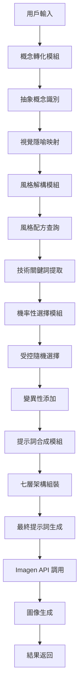
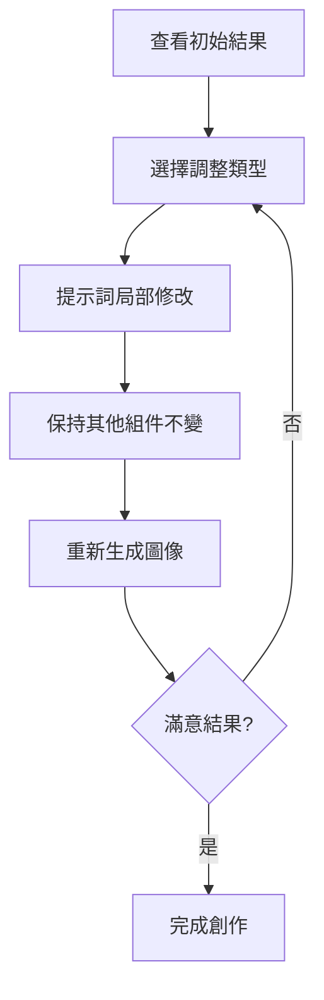

# AI Poster Generation System 技術文檔

## 📋 專案概述

AI Poster Generation System 是一個基於《提示詞優化海報生成框架》的智能海報生成系統，實現了從「關鍵詞生成」到「創意指導」的範式轉移。系統通過結構化的提示詞工程和智能化的概念轉化，為用戶提供專業級的海報設計解決方案。

## 🎯 核心功能

### 主要特性
1. **智能提示詞引擎**: 四個核心模組協同工作的提示詞生成系統
2. **概念轉化能力**: 將抽象主題轉化為具體視覺主體
3. **風格解構系統**: 將風格選擇解構為技術關鍵詞組合
4. **迭代優化服務**: 支援 12 種調整類型的即時優化
5. **結構化詞彙庫**: 五大類專業詞彙的系統化管理

### 技術創新
- **七層提示詞架構**: 模擬專業創意工作流程的結構化指令
- **機率性選擇機制**: 引入受控隨機性避免重複結果
- **風格配方系統**: 基於配方的風格定義和應用
- **抽象概念映射**: 自動將抽象概念轉化為視覺隱喻

## 🏗️ 系統架構

### 技術棧
```
後端: Python FastAPI + Google Gemini API
圖像生成: Google Imagen 4.0 Fast Generate
提示詞引擎: 自研的結構化提示詞生成系統
存儲: 本地文件系統 + JSON 配置
詞彙庫: 結構化的專業詞彙數據庫
```

### 核心模組

#### 1. 智能提示詞引擎 (`poster_prompt_engine.py`)

##### 四個核心模組
```python
class PosterPromptEngine:
    def __init__(self):
        self.concept_transformer = ConceptTransformer()
        self.style_deconstructor = StyleDeconstructor()
        self.probabilistic_selector = ProbabilisticSelector()
        self.prompt_synthesizer = PromptSynthesizer()
    
    def generate_prompt(
        self, 
        theme: str, 
        style: str, 
        poster_type: str
    ) -> EnhancedPrompt:
        # 四模組協同工作生成最終提示詞
        pass
```

##### 第一模組：概念轉化
```python
class ConceptTransformer:
    ABSTRACT_CONCEPTS = {
        "創新": [
            "glowing neural networks",
            "abstract geometric forms unfolding",
            "schematic blueprints with light traces"
        ],
        "連接": [
            "interwoven lines of light",
            "glowing nodes in a network",
            "digital handshake visualization"
        ],
        "安全": [
            "shield made of light particles",
            "crystalline protective barrier",
            "biometric pattern visualization"
        ]
    }
    
    def transform_abstract_to_visual(self, theme: str) -> str:
        # 將抽象主題轉化為具體視覺主體
        pass
```

##### 第二模組：風格解構
```python
class StyleDeconstructor:
    STYLE_RECIPES = {
        "corporate_formal": {
            "composition": ["minimalist", "significant negative space", "centered"],
            "lighting": ["soft studio light", "clean lighting"],
            "color_palette": ["navy blue and gray palette", "monochromatic"],
            "art_style": ["clean vector design", "professional illustration"],
            "mood": ["sophistication", "trustworthy", "professional"]
        },
        "modern_tech": {
            "composition": ["dynamic", "minimalist"],
            "lighting": ["dramatic accent lighting", "neon highlights"],
            "color_palette": ["vibrant", "monochromatic with accent"],
            "art_style": ["3D render", "digital art"],
            "mood": ["innovative", "cutting-edge", "futuristic"]
        }
    }
    
    def deconstruct_style(self, style: str) -> StyleComponents:
        # 將風格選擇解構為技術關鍵詞組合
        pass
```

##### 第三模組：機率性選擇
```python
class ProbabilisticSelector:
    def select_with_probability(
        self, 
        options: List[str], 
        weights: List[float]
    ) -> str:
        # 基於權重進行機率性選擇，避免重複結果
        pass
    
    def add_controlled_variance(self, components: StyleComponents) -> StyleComponents:
        # 為風格組件添加受控的變異性
        pass
```

##### 第四模組：提示詞合成
```python
class PromptSynthesizer:
    SEVEN_LAYER_ARCHITECTURE = [
        "composition_and_framing",      # 構圖與取景
        "main_subject_and_action",      # 主要主體與動作
        "scene_and_environment",        # 場景與環境細節
        "art_style_and_medium",         # 藝術風格與媒介
        "color_palette_and_lighting",   # 調色盤與光照
        "atmosphere_and_mood",          # 氛圍與情緒
        "technical_specifications"      # 技術與格式規範
    ]
    
    def synthesize_final_prompt(self, components: Dict[str, Any]) -> str:
        # 按七層架構組裝最終提示詞
        pass
```

#### 2. 迭代優化服務 (`poster_iteration_service.py`)

##### 12 種調整類型
```python
class PosterIterationService:
    ADJUSTMENT_TYPES = {
        # 戲劇性調整
        "more_dramatic": {
            "lighting": ["dramatic lighting", "chiaroscuro", "high contrast"],
            "composition": ["dynamic angle", "dramatic perspective"]
        },
        "less_dramatic": {
            "lighting": ["soft even lighting", "natural light"],
            "composition": ["balanced", "centered", "stable"]
        },
        
        # 色彩調整
        "change_palette": {
            "color": ["different color scheme", "contrasting palette"]
        },
        "warmer_colors": {
            "color": ["warm tones", "golden hour", "amber lighting"]
        },
        "cooler_colors": {
            "color": ["cool tones", "blue palette", "moonlight"]
        },
        
        # 構圖調整
        "different_angle": {
            "composition": ["bird's eye view", "low angle", "side view"]
        },
        "more_minimal": {
            "composition": ["extreme minimalism", "more negative space"]
        },
        "more_detailed": {
            "style": ["highly detailed", "intricate", "complex"]
        },
        
        # 光照調整
        "brighter": {
            "lighting": ["bright lighting", "high key", "luminous"]
        },
        "darker": {
            "lighting": ["moody lighting", "low key", "shadows"]
        },
        
        # 風格調整
        "more_professional": {
            "style": ["corporate", "clean", "polished"]
        },
        "more_creative": {
            "style": ["artistic", "experimental", "avant-garde"]
        }
    }
    
    def adjust_prompt(
        self, 
        original_prompt: str, 
        adjustment_type: str
    ) -> str:
        # 精確修改提示詞的特定部分
        pass
```

#### 3. 結構化詞彙庫 (`vocabulary_manager.py`)

##### 五大類專業詞彙
```python
class VocabularyManager:
    VOCABULARY_CATEGORIES = {
        "art_styles_and_movements": {
            "Art Deco": {
                "keywords": ["geometric patterns", "symmetrical", "gold accents"],
                "best_use": "luxury products, jazz concerts, high-end events"
            },
            "Bauhaus": {
                "keywords": ["geometric shapes", "primary colors", "functionalist"],
                "best_use": "architecture, tech posters, minimalist design"
            }
        },
        
        "modern_illustration_styles": {
            "Flat Design": {
                "keywords": ["simple shapes", "bright colors", "minimal details"],
                "best_use": "UI/UX design, corporate materials"
            },
            "Isometric": {
                "keywords": ["3D-like elements", "technical feel", "bird's-eye view"],
                "best_use": "tech infographics, process diagrams"
            }
        },
        
        "medium_and_techniques": {
            "Vector Graphic": {
                "keywords": ["clean lines", "solid colors", "scalable"],
                "visual_effect": "sharp, modern graphics suitable for logos"
            },
            "Risograph": {
                "keywords": ["vibrant", "grainy texture", "misaligned print"],
                "visual_effect": "retro feel with color vibrancy and imperfections"
            }
        },
        
        "composition_and_framing": {
            "rule_of_thirds": "classic composition for visual harmony",
            "negative_space": "modern design key for highlighting subjects",
            "symmetrical_composition": "conveys stability and formality"
        },
        
        "lighting_and_atmosphere": {
            "golden_hour": "warm, soft, long shadows with nostalgic feel",
            "studio_light": "even, soft shadows for professional photography",
            "neon_glow": "core element of cyberpunk and retro styles"
        }
    }
```

## 📊 數據模型

### 核心數據結構

#### PosterRequest (海報請求)
```python
class PosterRequest(BaseModel):
    text_content: str          # 海報文字內容
    style: str                # 風格選擇
    poster_type: str          # 海報類型
    additional_requirements: Optional[str] # 額外需求
```

#### EnhancedPrompt (增強提示詞)
```python
class EnhancedPrompt(BaseModel):
    final_prompt: str         # 最終提示詞
    components: Dict[str, str] # 各層組件
    style_applied: str        # 應用的風格
    concept_transformations: List[str] # 概念轉化記錄
    generation_metadata: Dict[str, Any] # 生成元數據
```

#### AdjustmentRequest (調整請求)
```python
class AdjustmentRequest(BaseModel):
    original_prompt: str      # 原始提示詞
    adjustment_type: str      # 調整類型
    session_id: str          # 會話 ID
    text_content: str        # 文字內容
```

#### GenerationResult (生成結果)
```python
class GenerationResult(BaseModel):
    image_url: str           # 生成的圖像 URL
    enhanced_prompt: str     # 使用的提示詞
    generation_time: float   # 生成時間
    style_recipe: Dict[str, Any] # 風格配方
    iteration_history: List[str] # 迭代歷史
```

## 🎨 風格配方系統

### 四種預定義風格

#### 1. 企業正式風格 (Corporate Formal)
```python
CORPORATE_FORMAL = {
    "composition": {
        "primary": ["minimalist", "significant negative space"],
        "secondary": ["centered", "balanced"],
        "probability_weights": [0.7, 0.2, 0.1]
    },
    "lighting": {
        "primary": ["soft studio light"],
        "secondary": ["clean natural light", "even lighting"],
        "probability_weights": [0.8, 0.15, 0.05]
    },
    "color_palette": {
        "primary": ["navy blue and gray palette"],
        "secondary": ["monochromatic with white", "professional blue tones"],
        "probability_weights": [0.6, 0.3, 0.1]
    },
    "mood": ["sophistication", "trustworthy", "professional"]
}
```

#### 2. 現代科技風格 (Modern Tech)
```python
MODERN_TECH = {
    "composition": {
        "primary": ["dynamic", "minimalist"],
        "secondary": ["asymmetrical", "geometric"],
        "probability_weights": [0.6, 0.3, 0.1]
    },
    "lighting": {
        "primary": ["dramatic accent lighting"],
        "secondary": ["neon highlights", "rim lighting"],
        "probability_weights": [0.5, 0.3, 0.2]
    },
    "color_palette": {
        "primary": ["vibrant with dark background"],
        "secondary": ["monochromatic with neon accent", "cyberpunk colors"],
        "probability_weights": [0.5, 0.3, 0.2]
    },
    "mood": ["innovative", "cutting-edge", "futuristic"]
}
```

## 🔄 生成流程

### 海報生成工作流程


### 迭代優化流程


## 🚀 API 端點

### 主要 API 路由

#### 1. 生成海報
```http
POST /api/v1/generate-poster
Content-Type: multipart/form-data

{
  "text_content": "AI 驅動的網絡安全產品發布",
  "style": "modern_tech",
  "poster_type": "announcement"
}
```

#### 2. 調整海報
```http
POST /api/v1/adjust-poster
Content-Type: multipart/form-data

{
  "original_prompt": "...",
  "adjustment_type": "more_dramatic",
  "session_id": "uuid",
  "text_content": "..."
}
```

#### 3. 獲取風格列表
```http
GET /api/v1/styles
```

#### 4. 獲取調整選項
```http
GET /api/v1/adjustment-types
```

#### 5. 獲取生成歷史
```http
GET /api/v1/generation-history/{session_id}
```

## 🔧 配置與部署

### 環境變數
```env
# Google AI 服務配置
GEMINI_API_KEY=your_gemini_api_key_here

# 圖像生成配置
IMAGEN_MODEL=imagen-4.0-fast-generate-001
DEFAULT_ASPECT_RATIO=16:9
DEFAULT_QUALITY=high

# 存儲配置
GENERATED_IMAGES_DIR=./generated_images
MAX_IMAGE_SIZE=10MB
IMAGE_RETENTION_DAYS=30

# 提示詞引擎配置
ENABLE_PROBABILISTIC_SELECTION=true
DEFAULT_VARIANCE_LEVEL=0.3
MAX_PROMPT_LENGTH=2000

# 詞彙庫配置
VOCABULARY_UPDATE_INTERVAL=24h
CUSTOM_VOCABULARY_ENABLED=false
```

### 部署需求
- **Python**: 3.8+
- **磁盤空間**: 至少 50GB (用於圖像存儲和詞彙庫)
- **記憶體**: 建議 8GB+ (複雜提示詞處理)
- **網路**: 穩定的網際網路連接 (Imagen API)

## 📈 性能監控

### 系統指標
```python
class PerformanceMonitor:
    def track_generation_metrics(self) -> GenerationMetrics:
        return {
            "average_generation_time": 15.2,  # 秒
            "success_rate": 0.95,
            "prompt_complexity_score": 8.7,
            "user_satisfaction_rate": 0.89
        }
    
    def analyze_style_usage(self) -> StyleUsageReport:
        # 分析各風格的使用頻率和成功率
        pass
    
    def monitor_api_costs(self) -> CostReport:
        # 監控 Imagen API 使用成本
        pass
```

### 品質控制
```python
class QualityAssurance:
    def validate_prompt_quality(self, prompt: str) -> QualityScore:
        # 評估提示詞品質
        pass
    
    def detect_generation_anomalies(self, results: List[GenerationResult]) -> List[Anomaly]:
        # 檢測生成異常
        pass
    
    def collect_user_feedback(self, image_id: str, rating: int, comments: str):
        # 收集用戶反饋
        pass
```

## 🧪 測試策略

### 功能測試
- 概念轉化準確性測試
- 風格解構一致性測試
- 提示詞合成邏輯測試
- 迭代優化效果測試

### 創意品質測試
- 不同風格的視覺效果驗證
- 抽象概念轉化效果評估
- 機率性選擇的多樣性測試
- 用戶滿意度調查

### 性能測試
- 大量並發生成請求
- 複雜提示詞處理性能
- 詞彙庫查詢效率
- API 響應時間監控

## 🔮 未來發展

### 短期目標
1. **風格微調**: 支援企業品牌專屬風格訓練
2. **自定義配方**: 允許用戶創建和保存個人風格配方
3. **A/B 測試**: 自動生成多個版本供用戶選擇

### 長期規劃
1. **分步構圖控制**: 結合 Inpainting/Outpainting 技術
2. **多語言支援**: 擴展到其他語言的概念識別
3. **智能學習**: 基於用戶偏好自動優化風格配方

### 商業化功能
1. **企業版**: 私有部署和品牌定制
2. **API 服務**: 面向開發者的 API 訂閱
3. **設計師工具**: 專業設計師的高級功能

---

**維護者**: AI Tools 開發團隊  
**最後更新**: 2024年12月  
**版本**: v1.0.0